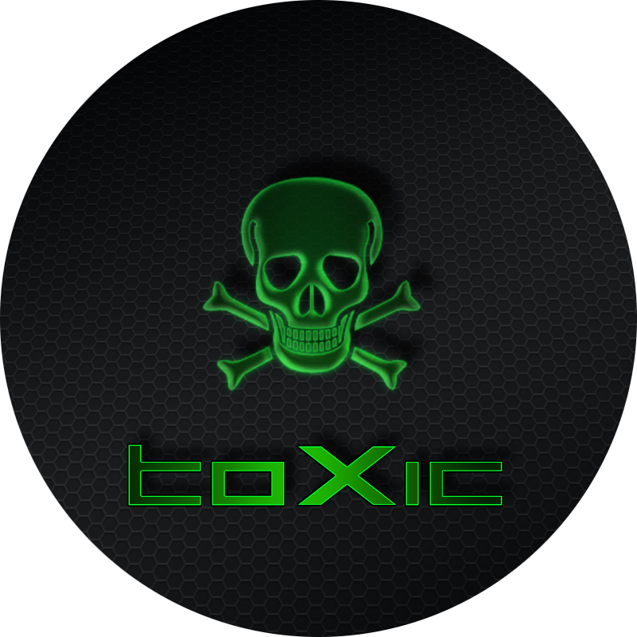

# Toxicblue

<p align="center">
  
</p>

[](https://app.codacy.com/gh/toxicwebdev/toxicblue-dx/dashboard?utm_source=gh&utm_medium=referral&utm_content=&utm_campaign=Badge_grade)
[](https://github.com/toxicwebdev/toxicblue-dx/actions/workflows/build-dx.yml)
[](https://github.com/toxicwebdev/toxicblue-dx/actions/workflows/build-nvidia-dx.yml)
[](https://github.com/toxicwebdev/toxicblue/actions/workflows/trivy.yml)

## Overview

toxicblue-dx is a project that leverages the [BlueBuild](https://blue-build.org/) template to create minimally-opinionated [Fedora Atomic](https://fedoraproject.org/atomic-desktops/) operating system images for various Wayland compositors.

## Features

The Toxicblue Developer Experience (toxicblue-dx) is a dedicated developer image with bundled tools, it offers a kickass cloud-native developer workflow with integrated container tools, declarative system management, and seamless CI/CD integration.  Unlike traditional Linux systems, the operating system and developer environment are explicitly and purposely separated. This means that tooling is not installed on the host, and is instead containerized, in a virtual machine, or scoped to the user's home directory. It is designed to meet the following use cases:

Toxicblue Developer Experience endeavors to ship:

- The world's most powerful cloud native developer environment
- Full virtualization support centered around QEMU/KVM, as well as support for Docker and Incus

## Purpose

Toxicblue Developer Experience goes "all in" on cloud native development and is used differently than a traditional distribution such as Ubuntu:

- Development is done in devcontainers
- Command line applications are installed using homebrew
- Preconfigured ad-hoc containers for Ubuntu, Fedora, and Wolfi are included. Use whichever distribution you want.

This differs from traditional distributions by making the development process operating system agnostic. There is no equivalent to apt install php on Toxicblue Developer Experience; development is done with podman or docker directly via an IDE.

We also believe in easy access to other thriving ecosystems like Python via uv.

The pattern in toxicblue-dx centers around devcontainers. Since devcontainers live in the project's git repository, they can be deployed on any operating system: Linux, macOS, or Windows (via WSL). This facilitates "distributed by default" development and avoids Linux users being "the odd one out" when working with teammates on other operating systems.

Each project includes a declarative environment intended to start the user with a "best practice" cloud-native workflow out of the box. The Ultimate Guide to Dev Containers has a good write-up on the advantages of using devcontainers. This means that the development environment is kept in version control instead of coupled to the host.

Homebrew can also be used to install development tools. However, it is recommended to avoid that and declare the project's dependencies in version control.

## Customization

For custom modifications, it's recommended to create a new repo using the [BlueBuild template](https://github.com/blue-build/template) rather than forking this project. Set your `base-image` to a toxicblue image to apply your customizations efficiently without constant upstream synchronization.

## Verification

Images are signed using [Sigstore](https://www.sigstore.dev/)'s [cosign](https://github.com/sigstore/cosign). Verify signatures by downloading the `cosign.pub` file and running:

```bash
cosign verify --key cosign.pub ghcr.io/toxicwebdev/$IMAGE_NAME:latest
```

## Contributing

Please refer to the [contributing documentation](CONTRIBUTING.md#contributing) and adhere to the [Code of Conduct](CODE_OF_CONDUCT.md).
